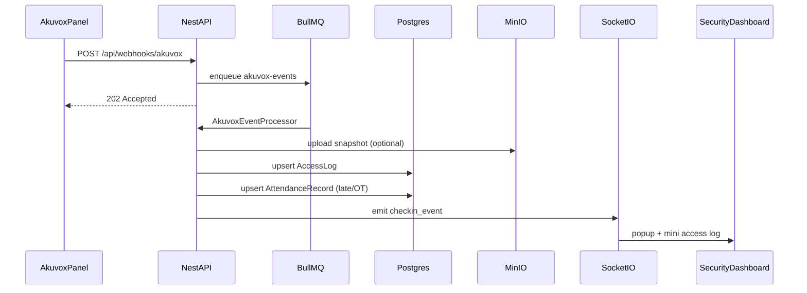

# Access Control V2 — Architecture

Hệ thống quản lý chấm công FaceID (Akuvox) và giám sát camera thời gian thực (go2rtc WebRTC, proxy SDP qua backend), monorepo NestJS + Next.js.

## High-level components

| Component | Role |
|-----------|------|
| `apps/api` | NestJS REST + Socket.io + BullMQ workers |
| `apps/web` | Next.js 15 admin + security dashboard |
| `packages/shared` | Shared types (API envelope, webhook payload, enums) |
| PostgreSQL | Primary data store (Prisma) |
| Redis | BullMQ job queue |
| MinIO | Snapshots / face images (S3 API) |
| go2rtc (host) | RTSP → WebRTC for camera grid; backend proxies SDP via `POST /devices/:id/webrtc` |

## Data flow — Akuvox webhook → attendance → live UI



## Module map (`apps/api`)

- `auth` — login / refresh, JWT global guard (`@Public` for login, webhook, health)
- `users` / `departments` / `roles` — org CRUD
- `shifts` — work shifts + employee assignments + default shift
- `devices` — Akuvox/Camera CRUD, stream URL, open-door, sync-credentials
- `device-mappings` — Akuvox ↔ Camera links
- `credentials` — Face / card credential storage
- `webhooks` — inbound Akuvox HTTP receiver
- `queue` — BullMQ processor
- `attendance` — records, access logs, Excel export
- `events` — Socket.io `/events`
- `storage` — MinIO client
- `health` — postgres / redis / minio checks

## Attendance rules

1. Resolve active `EmployeeShift` for the user on that calendar day; else default work shift.
2. First punch of the day → `checkInAt`; late = minutes after `startTime + gracePeriodMinutes`.
3. Later punch → `checkOutAt`; early leave if before `endTime`; OT if after (overnight-aware).
4. `status` derived: `LATE` / `EARLY_LEAVE` / `OVERTIME` / `ON_TIME`.

## Environment

See [`.env.example`](./.env.example). Important keys:

- `DATABASE_URL`, `REDIS_HOST` / `REDIS_PORT`
- `MINIO_*`, `JWT_SECRET`
- `GO2RTC_BASE_URL`, `GO2RTC_ENABLED`, `GO2RTC_AUTO_START`, `NEXT_PUBLIC_API_URL`, `NEXT_PUBLIC_WS_URL`
- `AKUVOX_MOCK_MODE` (default `true` for local without panels)

## Local development

> Docker Desktop must be running for `pnpm docker:up` (Postgres, Redis, MinIO).
> go2rtc runs on the host (not Docker); install it once, then the API auto-starts it.

```bash
cp .env.example .env
pnpm install
pnpm docker:up
pnpm db:generate && pnpm db:migrate && pnpm db:seed
pnpm --filter @acv2/api go2rtc:install   # once, for camera live view
pnpm dev
```

- Web: http://localhost:3000  
- API: http://localhost:8080/api  
- Swagger: http://localhost:8080/api/docs  

Default login: `admin` / `admin123`

## Production Compose

```bash
pnpm docker:prod
# or
docker compose -f docker-compose.prod.yml up -d --build
```

Builds `apps/api` and `apps/web` images and wires them to postgres, redis, minio. Camera live view still relies on go2rtc running on the host.

## Multi-site / VPN deploy

Kiến trúc theo sơ đồ khách: **máy Face tại công trường chỉ gửi sự kiện**; toàn bộ xử lý chấm công chạy tại server trung tâm. Không dựng server local tại công trường.

| Khái niệm | Trong soft |
|-----------|------------|
| Công trường | `AccessZone` (Settings → Zones) |
| Máy nhận diện | Device `AKUVOX` / `DNAKE` gắn `zoneId` (1 panel cùng loại / zone) |
| Tripod / cổng xoay | Thiết bị vật lý do **relay** của máy Face điều khiển — không có device type riêng |
| VPN nội bộ | Hạ tầng mạng (site ↔ trung tâm). Soft chỉ cần API reachable và panel reachable đúng chiều |

### Chiều VPN theo loại máy

| Loại | Chiều kết nối | Ghi chú |
|------|---------------|--------|
| **Akuvox** | **Công trường → API trung tâm :8080** | Panel gọi webhook/door_log tới server. Firewall HQ: inbound TCP **8080** từ dải VPN site. Action URL nên kèm `deviceCode` (tránh nhầm khi NAT chung IP). |
| **DNAKE** | **API trung tâm → IP panel** | Server poll `/api/v1/logs/unlock` tới IP panel trên VPN. Firewall site: cho phép HQ gọi HTTP panel; không cần webhook DNAKE Cloud. |

### Checklist mỗi công trường mới

1. Tạo zone (tên công trường) trên UI **Settings → Zones**.
2. Đăng ký Device Akuvox hoặc DNAKE: IP trên LAN/VPN, `code`, `zoneId`, username/password HTTP API.
3. **Akuvox** — web panel → **Setting → Action URL** (Door / Relay Triggered), bật và dán:

```text
http://<IP_SERVER_VPN>:8080/api/webhooks/akuvox?ip=$ip&active_user=$active_user&relay1status=$relay1status&deviceCode=<MA_THIET_BI>
```

Door log (nếu dùng): cùng host, path `/api/webhooks/akuvox/door-log` + query `deviceCode`.

4. Trên server trung tâm (`.env` / `apps/api/.env`):
   - `API_PUBLIC_URL=http://<IP_SERVER_VPN>:8080` (máy Face tải ảnh mặt từ URL này)
   - `AKUVOX_MOCK_MODE=false`
   - `DNAKE_POLL_ENABLED=true` (nếu có DNAKE)
   - Firewall: Akuvox → mở **inbound TCP 8080**; DNAKE → HQ phải route tới IP panel
5. Gán quyền zone cho nhân viên (provision, mặc định **1 khu**) → sync face xuống máy thuộc zone đó.
6. (Tuỳ chọn) Camera + mapping đầu đọc↔camera để snapshot vào/ra trên màn Giám sát.

### Vận hành / báo cáo

- Checklist ca đêm: [`docs/night-shift-ops-checklist.md`](./docs/night-shift-ops-checklist.md)
- Test 12 làn / NAT: [`docs/load-test-12-lanes.md`](./docs/load-test-12-lanes.md)
- **Sự kiện** (`AccessLog`): `deviceId`, `zoneId`, `projectId` (snapshot lúc quét)
- **Báo cáo tuần / chi tiết**: cột khu vực + tên máy gắn theo lần vào gần nhất
- Điều chuyển CN nhà thầu: Nhân sự → nút điều chuyển dự án (lịch sử `UserProjectTransfer`)

### Lưu ý báo cáo

- **Sự kiện ra vào** (`AccessLog`) gắn `deviceId` + `zoneId` → lọc theo công trường trên Giám sát / nhật ký.
- **Chấm công ngày** (`AttendanceRecord`) vẫn theo nhân viên / ngày tại trung tâm; địa điểm xem qua AccessLog / cột khu vực–máy trên báo cáo.
## API smoke tests

```bash
# Login
curl -s -X POST http://localhost:8080/api/auth/login \
  -H "Content-Type: application/json" \
  -d '{"username":"admin","password":"admin123"}'

# Webhook (uses seed device AKUVOX-MAIN + EMP001 when seeded)
curl -s -X POST http://localhost:8080/api/webhooks/akuvox \
  -H "Content-Type: application/json" \
  -d '{"eventId":"test-001","employeeCode":"EMP001","deviceCode":"AKUVOX-MAIN","timestamp":"2026-07-14T08:10:00Z"}'
```
